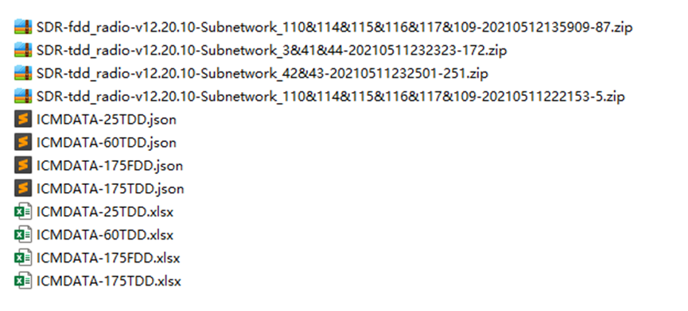
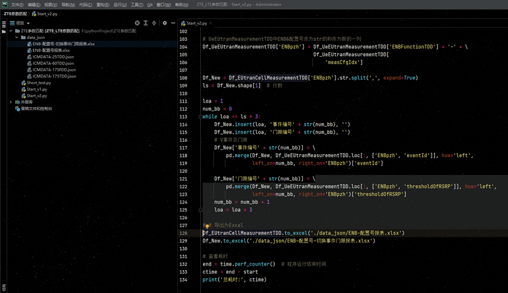
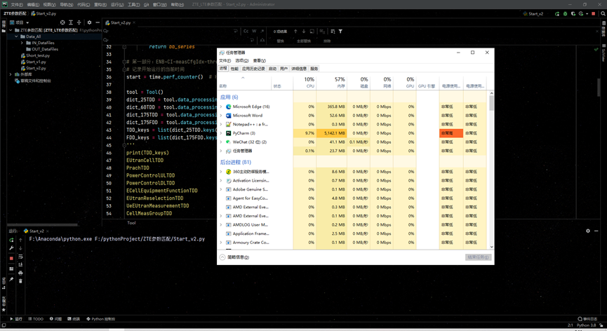
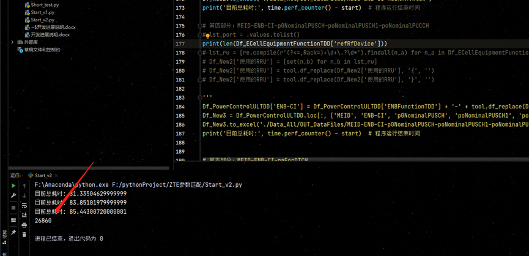
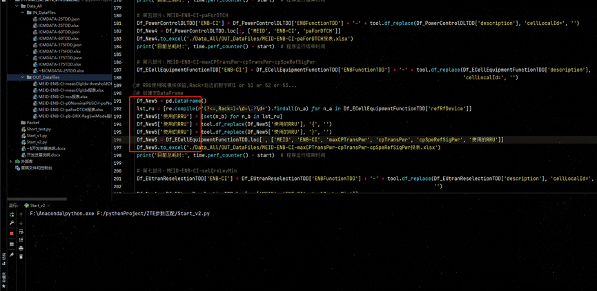
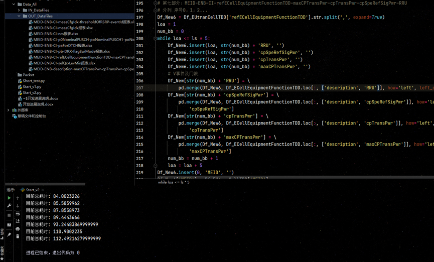
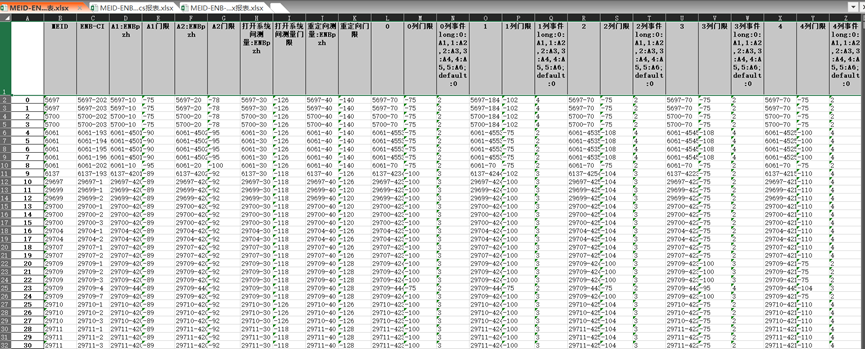
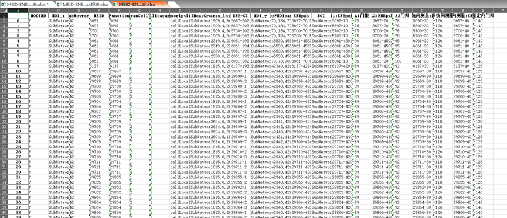
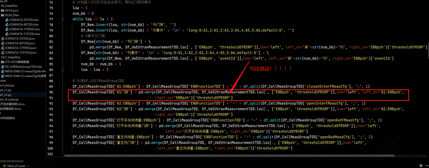
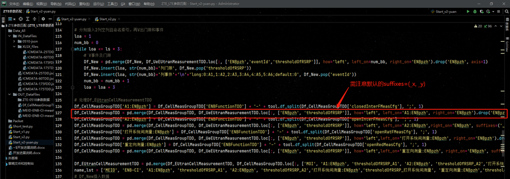

# ZTE参数匹配注册版

 适用于对现网ZTE参数快速整理输出，以作为分析优化的参考。


## 20210513 - excel2json

1.参数模板定制：现网ICM选定需要的参数属性，固定模板。

2.数据量大，不适合pandas直接读取，内存消耗大，下载excel2json开源EXCEL转JSON数据工具，将现网参数EXCEL转为JSON数据

**excel2json参数说明：**

```
excel2json --help
```

```
-e、 --需要excel。输入excel文件路径。
-j、 --json导出json文件路径。
-p、 --csharp导出C#数据结构代码文件路径。
-h、 --标题（默认值：1）将工作表中的行数作为标题。
-c、 --编码（默认值：utf8 nobom）导出文件编码。
-l、 --lowcase（默认值：False）将文件名转换为lowcase。
-a、 --数组（默认值：False）导出为数组，否则导出为dict对象。
-d、 --日期（默认：yyyy/MM/dd）日期格式字符串，示例：dd/年月日时：分：秒。
-s、 --使用图纸名称导出图纸（默认值：False），即使有只有一张纸。
-x、 --排除前缀（默认值：）排除以开头的工作表或列指定的前缀。
-l、 --cell_json（默认值：False）转换单元格中的json字符串
```

**ExcelTo Json命令：**

```
excel2json -h 5 -a False  -e F:\MY_STUDY\PYTHONPROJECTS\ZTE参数匹配注册版\DATA_ALL\IN_DATAFILES\ICMDATA-25TDD.xlsx  -j F:\MY_STUDY\PYTHONPROJECTS\ZTE参数匹配注册版\DATA_ALL\IN_DATAFILES\ICMDATA-25TDD.json

excel2json -h 5  -a False  -e F:\MY_STUDY\PYTHONPROJECTS\ZTE参数匹配注册版\DATA_ALL\IN_DATAFILES\ICMDATA-60TDD.xlsx  -j F:\MY_STUDY\PYTHONPROJECTS\ZTE参数匹配注册版\DATA_ALL\IN_DATAFILES\ICMDATA-60TDD.json

excel2json -h 5 -a False  -e F:\MY_STUDY\PYTHONPROJECTS\ZTE参数匹配注册版\DATA_ALL\IN_DATAFILES\ICMDATA-175TDD.xlsx  -j F:\MY_STUDY\PYTHONPROJECTS\ZTE参数匹配注册版\DATA_ALL\IN_DATAFILES\ICMDATA-175TDD.json

excel2json -h 5 -a False  -e F:\MY_STUDY\PYTHONPROJECTS\ZTE参数匹配注册版\DATA_ALL\IN_DATAFILES\ICMDATA-175FDD.xlsx  -j F:\MY_STUDY\PYTHONPROJECTS\ZTE参数匹配注册版\DATA_ALL\IN_DATAFILES\ICMDATA-175FDD.json
```

 

针对获取到的zip文件，python后边优化可以使用对应的**zipfile**模块进行解压，**os**模块可以调用命令使用excel2json进行转换。


## 20210514 - 初始效果

完成输出TDD小区报表输出切换事件、门限，目前FDD小区信息需要先手动统一首行信息，再进行处理。

效果展示： 

 

 发现难点问题：CPU、内存消耗大，内存消耗基本5543M左右

 

## 20210516 - CPU及内存消耗

CPU占用：AMD Ryzen 7 4800H with Radeon Graphics  2.90 GHz ——> 10%

内存占用：16G ——> 57%

  

原表数据处理代码基本完成，后续完善匹配出小区使用的RRU，方便到时候去V匹配序列号


## 20210517 - 出现缺失bug

遇见问题：Df_ECellEquipmentFunctionTDD['refRfDevice']

  个数只有26860 , Why?

 


## 20210518 - 修复变量错误Bug

今日重新检查代码，发现Df_New5 写成了Df_New3

当把不同len的Seires组合到DataFrame会产生长度不匹错误！导致生成失败。

  

修改后重新运行：

 

成果展示：

1.小区A1-A5事件及门限

  

2.小区重定向门限

  

3.小区NCS值

  等等…

需完善：由于fdd与tdd表名及每个表的表头不一致，需要手动更改，才能实现合并。


## 20210519 - 困难解决

遇见困难-发现V的门限对不上！ 猜想是索引对应出了问题，需重新思考算法！


## 20210520 - 困难解决

夜以继日，继续思考 ， 寻找Bug!


## 20210521 - 困难解决

夜以继日，继续思考 ， 寻找Bug


## 20210522 - 困难解决

借助spyder查看变量变化过程，发现问题：

  

Pd.merge直接以这样的方式V出来的数据时混乱的，根本对应不上，满足不了需求！

 

改后：

  

 

FDD表名表头统一问题已解决！至此已开发完成，存在问题即为内存、cpu消耗较大。

运行exe需要用到：F:\Anaconda\pkgs\mkl-2021.2.0-haa95532_296\Library\bin\mkl_intel_thread.1.dll


## 20210813 - 网管割接需重新定义名称

割接后，重新更改

```
.\excel2json.exe -h 5 -a False  -e F:\MY_STUDY\PYTHONPROJECTS\ZTE参数匹配注册版\DATA_ALL\IN_DATAFILES\ICMDATA-FDD1.xlsx  -j F:\MY_STUDY\PYTHONPROJECTS\ZTE参数匹配注册版\DATA_ALL\IN_DATAFILES\ICMDATA-FDD1.json

.\excel2json.exe -h 5 -a False  -e F:\MY_STUDY\PYTHONPROJECTS\ZTE参数匹配注册版\DATA_ALL\IN_DATAFILES\ICMDATA-FDD2.xlsx  -j F:\MY_STUDY\PYTHONPROJECTS\ZTE参数匹配注册版\DATA_ALL\IN_DATAFILES\ICMDATA-FDD2.json

.\excel2json.exe -h 5 -a False  -e F:\MY_STUDY\PYTHONPROJECTS\ZTE参数匹配注册版\DATA_ALL\IN_DATAFILES\ICMDATA-TDD1.xlsx  -j F:\MY_STUDY\PYTHONPROJECTS\ZTE参数匹配注册版\DATA_ALL\IN_DATAFILES\ICMDATA-TDD1.json

.\excel2json.exe -h 5 -a False  -e F:\MY_STUDY\PYTHONPROJECTS\ZTE参数匹配注册版\DATA_ALL\IN_DATAFILES\ICMDATA-TDD2.xlsx  -j F:\MY_STUDY\PYTHONPROJECTS\ZTE参数匹配注册版\DATA_ALL\IN_DATAFILES\ICMDATA-TDD2.json
```

